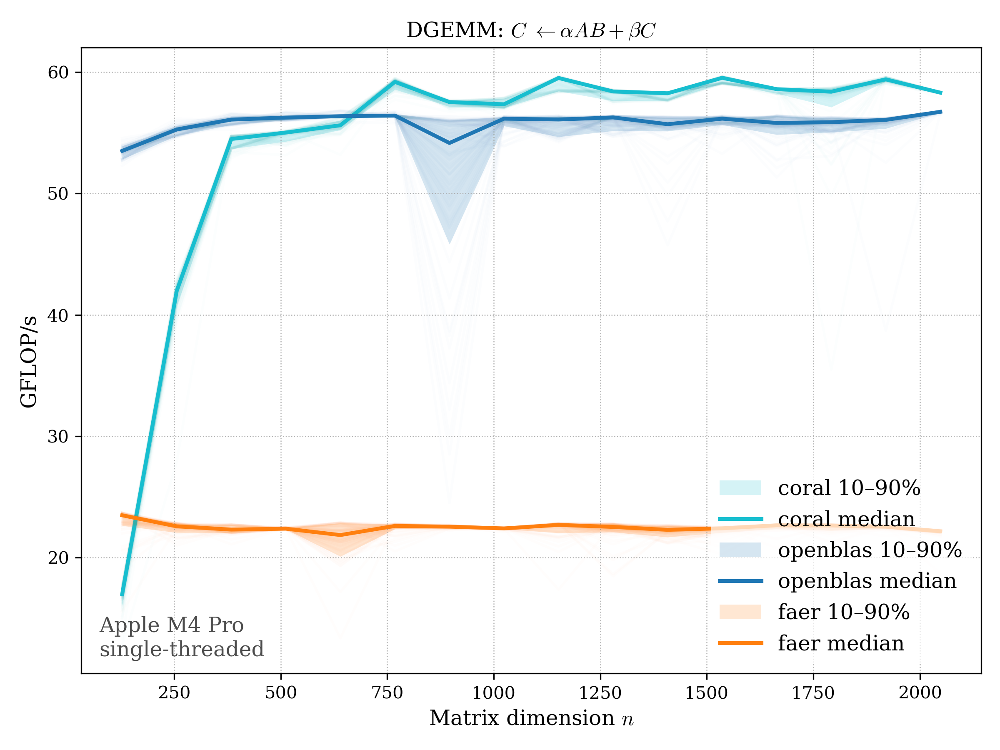
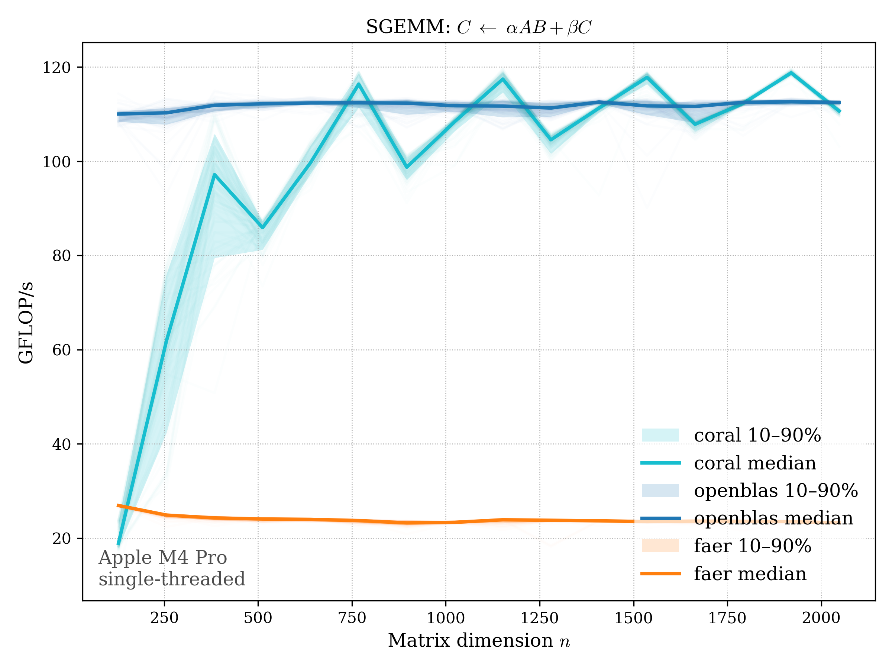

  

## Core Rust Architecture for Linear-algebra. 

Reaching BLAS performance while remaining 100% Rust.

> **Architecture:** Optimized currently for **AArch64 only**.

---

## Preliminary benchmarks

Early microbenchmarks (contiguous) suggest competitive performance up to 
$n \simeq 2.5 \times 10^3$.  Below are example `GEMM` benchmarks from 
[benches/plots/](benches/plots/). 

*Performed single-threaded on Apple Silicon.* 

### DGEMM 

### SGEMM 

The transpose GEMM variants are similar. Hence, for `GEMM`, CORAL
on AArch64 is well-comparable to OpenBLAS for large $n$. However, Apple Accelerate is
*exceptionally* fast for `GEMM/GEMV` routines (on Apple silicon). It is not included in the above
benchmarks as it masks any comparison between CORAL and OpenBLAS. For some Level
2 routines though, primarily `TRMV/TRSV`, CORAL does outperform both OpenBLAS and 
Apple Accelerate (for $n \leq 2.5 \times 10^3$). 

These benchmarks, along with the transpose variants of `GEMM` are 
also in [benches/plots](benches/plots/).  

*These results are preliminary and subject to change as kernels and packing strategies evolve.*

